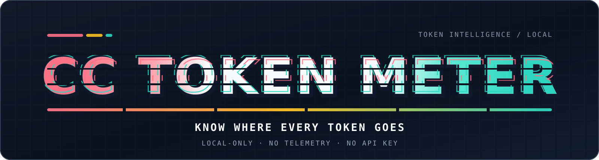
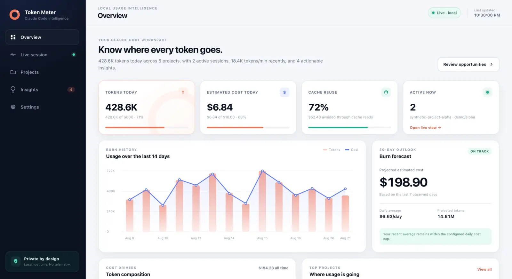
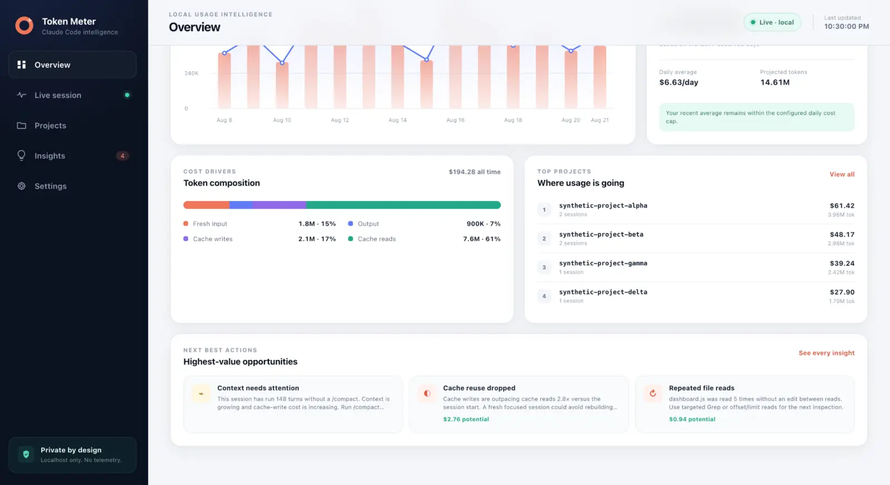
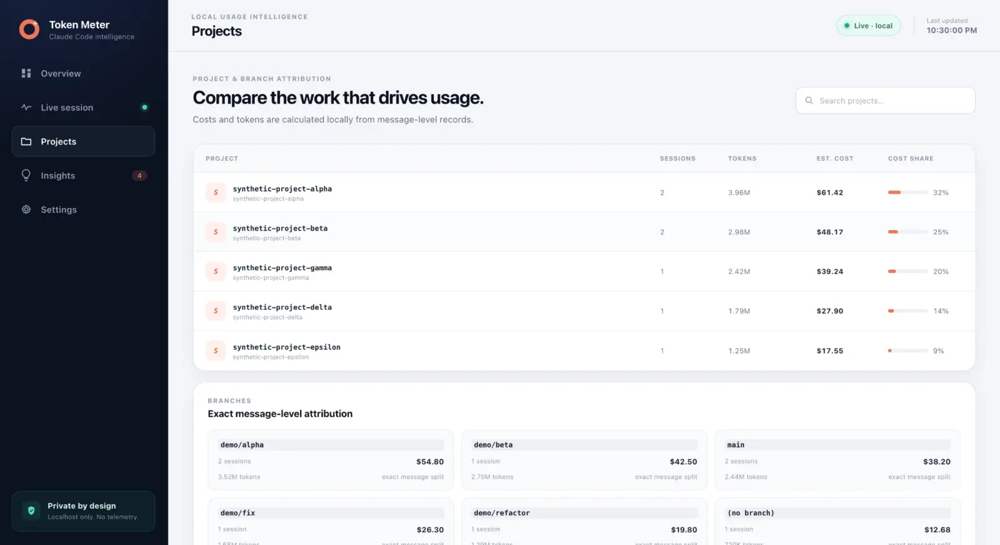
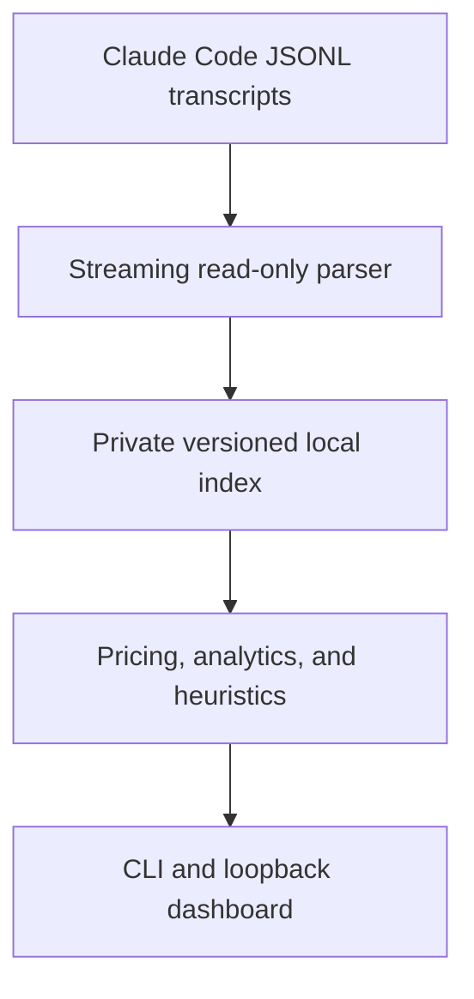

<div align="center">
  

  <h1>CC Token Meter</h1>

  <p><strong>Private, local usage intelligence for Claude Code.</strong></p>
  <p>Live token usage · Cost estimates · Cache intelligence · Budgets · Evidence-backed recommendations</p>
  <p><sub>Read-only transcripts · No API key · No telemetry · Windows, macOS, and Linux</sub></p>

  <p>
    <a href="https://www.npmjs.com/package/cc-token-meter"></a>
    <a href="https://www.npmjs.com/package/cc-token-meter"></a>
    <a href="https://github.com/Sabeekhann/cc-token-meter/actions/workflows/tests.yml"></a>
    <a href="https://app.codecov.io/github/Sabeekhann/cc-token-meter"></a>
    <a href="https://github.com/Sabeekhann/cc-token-meter/actions/workflows/compatibility.yml"></a>
    <a href="https://github.com/Sabeekhann/cc-token-meter/actions/workflows/security.yml"></a>
    <a href="https://socket.dev/npm/package/cc-token-meter/overview/1.2.0"></a>
    
    <a href="package.json"></a>
    <a href="LICENSE"></a>
    
  </p>

  <p>
    <a href="https://www.producthunt.com/products/cc-token-meter?embed=true&amp;utm_source=badge-featured&amp;utm_medium=badge&amp;utm_campaign=badge-cc-token-meter" target="_blank" rel="noopener noreferrer"></a>
  </p>

  <p>
    <a href="#dashboard-preview">Dashboard</a> ·
    <a href="#quick-start">Install</a> ·
    <a href="#what-you-get">Features</a> ·
    <a href="#cli-reference">CLI</a> ·
    <a href="#privacy-by-design">Privacy</a> ·
    <a href="#how-it-works">Architecture</a> ·
    <a href="#security-validation">Security</a> ·
    <a href="#contributing">Contribute</a>
  </p>

  <p>
    <a href="https://github.com/Sabeekhann/cc-token-meter/releases/latest">Latest release</a> ·
    <a href="docs/CI.md">CI &amp; compatibility</a> ·
    <a href="SECURITY.md">Security</a> ·
    <a href="CLAUDE.md">Agent guide</a>
  </p>
</div>

---

Claude Code Token Meter turns the session data already on your machine into a useful operating view. It helps answer four questions quickly:

1. **What is using tokens right now?**
2. **Which projects, branches, sessions, and models drive the cost?**
3. **Is prompt caching helping?**
4. **What should I change next?**

It requires no API key, makes no Anthropic API call, works retroactively, and treats Claude Code transcripts as read-only input.

> [!IMPORTANT]
> Dollar values are local estimates, not an Anthropic bill. Pricing rules can change; verify important decisions against [Anthropic's official pricing documentation](https://platform.claude.com/docs/en/about-claude/pricing).

## Release status

The current **v1.2.0** release adds exact model/date usage exploration in the CLI, local API, and Projects dashboard; scoped attribution across recent and compacted history; and stronger cross-platform release gates while preserving the local-only privacy model.

The [latest GitHub release](https://github.com/Sabeekhann/cc-token-meter/releases/latest) and npm version badge above are the authoritative published versions. Updating repository package metadata does not publish a package; release publication remains an explicit maintainer action. See [`CHANGELOG.md`](CHANGELOG.md) for the version-by-version history.

## What you get

| Capability | What it gives you |
| --- | --- |
| **Overview** | Today's tokens and estimated cost, cache reuse, active sessions, a 14-day history, and a 30-day forecast. |
| **Live Session** | Recent tokens/minute, estimated cost/hour, models, branches, and message-level burn while Claude Code is running. |
| **Projects** | Exact per-message attribution across projects, branches, and sessions. |
| **Insights** | Ranked, evidence-backed recommendations for repeated reads, cache degradation, large tool output, long context, and outlier sessions. |
| **Budgets** | Daily token, daily cost, and per-session cost guardrails stored locally. |
| **Exports** | Human-readable terminal summaries plus JSON and CSV for your own analysis. |
| **Doctor** | Checks the Node runtime, transcript access, index/config health, and local-state permissions. |

The dashboard is organized around five focused views: **Overview**, **Live Session**, **Projects**, **Insights**, and **Settings**. For UI implementation details, see [`docs/UI_PLAN.md`](docs/UI_PLAN.md).

## Dashboard preview

<a href="docs/media/cc-token-meter-demo.mp4">
  
</a>

<p align="center">
  <strong><a href="docs/media/cc-token-meter-demo.mp4">Watch the 12-second product tour</a></strong><br />
  <sub>Synthetic data only. No personal transcript content or private project paths.</sub>
</p>

<details>
  <summary><strong>Explore cost insights and project attribution</strong></summary>
  <br />
  
  <p align="center"><sub>Token composition, cost drivers, and highest-value opportunities.</sub></p>
  <br />
  
  <p align="center"><sub>Exact message-level attribution across projects and branches.</sub></p>
</details>

## Quick start

Node.js 20 or newer is required.

```bash
npx --yes cc-token-meter@latest
```

That is the complete install-and-run path. It starts a loopback-only server on
`127.0.0.1:4317` (or the next available port), opens the dashboard, indexes the
Claude Code history already stored on your machine, and streams local updates
with Server-Sent Events.

If the dashboard is empty, use Claude Code for at least one session and run the
command again. The meter reads existing transcripts from `~/.claude/projects`;
it does not require an Anthropic API key.

### Compatibility

| Requirement | Supported contract |
| --- | --- |
| **Node.js** | Version 20 or newer; CI exercises Node.js 20, 22, 24, and 26. |
| **Operating systems** | Linux, macOS, and Windows are covered by the compatibility workflow. |
| **Claude Code data** | Existing local JSONL transcripts under `~/.claude/projects`. |
| **Network posture** | No external runtime requests; the dashboard listens only on `127.0.0.1`. |
| **Upgrade path** | Existing valid v2 indexes migrate automatically to the bounded v3 format. |

### Install as a reusable command

```bash
npm install --global cc-token-meter
cc-token-meter
```

Upgrade or remove the global command at any time:

```bash
npm install --global cc-token-meter@latest
npm uninstall --global cc-token-meter
```

### Preview the UI safely from a source checkout

The synthetic preview is a development script and is **not** part of the published npm command surface. Run it only after cloning the repository and installing its locked dependencies:

```bash
npm ci
npm run preview:dashboard
```

Open `http://127.0.0.1:4318`. This preview uses clearly synthetic, rolling
fixture dates and never reads personal Claude Code transcripts. Its date,
project, and model queries run through the same summary/filtering code as the
local dashboard, so it is the best way to explore or work on the interface
from source.

## Privacy by design

Claude Code Token Meter reads session transcripts from:

```text
~/.claude/projects/**/*.jsonl
```

It writes only its own local state under:

```text
~/.claude-token-meter/config.json
~/.claude-token-meter/usage-index-v3.json
```

| Promise | Enforcement |
| --- | --- |
| Transcripts stay unchanged | Transcript access is strictly read-only. |
| The dashboard stays local | The server binds to `127.0.0.1`, not a public interface. |
| No telemetry | There is no analytics SDK, CDN asset, remote API, or update check. |
| Sensitive content is minimized | The private index stores normalized counters and metadata, not prompt or tool-result content. Detailed history is bounded; older counters become exact daily rollups. |
| Local state is recoverable | Index writes are atomic; the index can be deleted and rebuilt from the original transcripts. |

Use `--no-cache` to avoid reading or writing the local usage index.
Existing v2 indexes migrate automatically without reparsing unchanged
transcripts. See [large-history performance and retention](docs/PERFORMANCE.md)
for the retention contract and reproducible budgets.

## CLI reference

The commands below assume a global install. For one-off use, replace
`cc-token-meter` with `npx --yes cc-token-meter@latest`.

| Command | Purpose |
| --- | --- |
| `cc-token-meter` | Start the local dashboard. |
| `cc-token-meter --summary` | Print a compact usage summary and exit. |
| `cc-token-meter --json` | Print a machine-readable summary and exit. |
| `cc-token-meter --csv <path\|->` | Export filtered usage as CSV. Use `-` for stdout. |
| `cc-token-meter --doctor` | Diagnose the local setup and private state. |
| `cc-token-meter --set-budget-usd <n>` | Set a daily estimated-cost cap. |
| `cc-token-meter --set-budget-tokens <n>` | Set a daily token cap. |
| `cc-token-meter --set-session-budget-usd <n>` | Set a per-session estimated-cost cap. |
| `cc-token-meter --help` | Show all options. |

Common filters:

```text
--port <n>       Dashboard port (default: 4317, or the next free port)
--no-open        Do not open a browser automatically
--no-cache       Do not read or write the private local usage index
--from <date>    Include usage on/after local date YYYY-MM-DD
--to <date>      Include usage on/before local date YYYY-MM-DD
--project <text> Match project paths by case-insensitive substring
--model <id>     Match an exact model identifier (case-insensitive)
--group-by <n>   CSV rows: day, project, branch, or session
```

Examples:

```bash
cc-token-meter --port 5000 --no-open
cc-token-meter --summary --from 2026-08-01 --project my-app --model claude-sonnet-5
cc-token-meter --json --no-cache
cc-token-meter --csv usage.csv --group-by project
cc-token-meter --doctor --json
cc-token-meter --set-budget-usd 20
```

## How it works



- `src/ingest/` discovers transcripts, stream-parses changed files, and maintains normalized session records.
- `src/pricing/` applies date-aware local pricing rules and marks fallback estimates.
- `src/analytics/` computes activity, velocity, cache health, project attribution, and forecasts.
- `src/heuristics/` runs independent pure-function checks and returns actionable tips.
- `src/server/` exposes the local JSON/SSE API and serves the static dashboard from `public/`.

## What it does not do

- It does not intercept or modify Claude Code requests.
- It does not upload transcripts, prompts, tool output, or project paths.
- It does not replace Anthropic's authoritative billing data.
- It does not guarantee perfect project-path reconstruction when Claude Code's sanitized directory names are ambiguous.
- It does not make every heuristic certain; heuristic results are evidence-backed suggestions and should be reviewed in context.

## Security validation

CC Token Meter uses multiple repository-level security checks:

| Check | Role |
| --- | --- |
| **CodeQL** | Static analysis for JavaScript/TypeScript security issues. |
| **gitleaks** | Full-history credential and secret scanning. |
| **npm audit** | High-severity production dependency vulnerability checks. |
| **Corgea** | Additional SAST, Logic & Auth, secret, dependency, container, and IaC review of the repository. |

After the v1.1.1 dashboard hardening, a Corgea full scan of `main` reported **0 active findings** across the scanners executed. Corgea is a development/repository scanning service only: it is not a runtime dependency, is not shipped in the npm package, and does not alter CC Token Meter's local-only/no-telemetry runtime model.

See [`SECURITY.md`](SECURITY.md) for vulnerability reporting and [`docs/CI.md`](docs/CI.md) for automated security checks.

## Development

Run the project from source when contributing:

```bash
git clone https://github.com/Sabeekhann/cc-token-meter.git
cd cc-token-meter
npm ci
npm run ci
npm run preview:dashboard
```

`npm run ci` runs the repository policy gate and all tests. The policy gate
protects the local-only, loopback-only, dependency-light, pure-analytics,
browser-security, and no-remote-assets boundaries.

The repository also includes:

- a draft-first PR flow with `Required CI`, ready-review `Compatibility gate`,
  and `Corgea: Security Scan` required before normal merges;
- a separate informational Codecov coverage job and advisory dependency review;
- multi-platform Compatibility across Node 20, 22, 24, and 26 after a PR leaves
  Draft and again after merge, plus scheduled/manual CodeQL, gitleaks, and
  dependency auditing;
- Conventional Commit PR-title and template checks;
- automated area, size, and readiness labels;
- release-tag validation and token-free npm publishing through a trusted
  GitHub Actions publisher;
- Dependabot updates and repository-wide maintainer ownership.

See [`docs/CI.md`](docs/CI.md) for the exact draft-to-merge flow, checks, and
permissions.

## Contributing

Bug fixes, tests, documentation, pricing updates, heuristics, and focused UI improvements are welcome. Please read [`CONTRIBUTING.md`](CONTRIBUTING.md) before opening a pull request—especially the privacy rules for fixtures and screenshots.

- [Open a bug report](https://github.com/Sabeekhann/cc-token-meter/issues/new?template=bug.yml)
- [Propose a feature](https://github.com/Sabeekhann/cc-token-meter/issues/new?template=feature.yml)
- [Review the product plan](docs/V2_PLAN.md)
- [Review the code of conduct](CODE_OF_CONDUCT.md)
- [Report a vulnerability privately](SECURITY.md)

## License and trademark note

Released under the [Apache License 2.0](LICENSE). See [`NOTICE`](NOTICE) for attribution information.

The mascot in this repository is an original Claude Code Token Meter project asset. Claude and Claude Code are products of Anthropic. This independent project is not affiliated with or endorsed by Anthropic.
