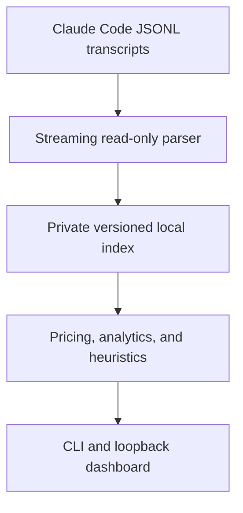

<div align="center">
  

  <h1>Claude Code Token Meter</h1>

  <p><strong>Your private, local usage cockpit for Claude Code.</strong></p>
  <p>Live token usage, cost estimates, cache intelligence, budgets, and practical recommendations—without sending your transcripts anywhere.</p>

  <p>
    <a href="https://github.com/Sabeekhann/cc-token-meter/actions/workflows/tests.yml"></a>
    <a href="https://github.com/Sabeekhann/cc-token-meter/actions/workflows/security.yml"></a>
    <a href="package.json"></a>
    <a href="LICENSE"></a>
    
  </p>

  <p>
    <a href="#quick-start">Quick start</a> ·
    <a href="#what-you-get">Features</a> ·
    <a href="#cli-reference">CLI</a> ·
    <a href="CONTRIBUTING.md">Contribute</a>
  </p>
</div>

---

Claude Code Token Meter turns the session data already on your machine into a useful operating view. It helps answer four questions quickly:

1. **What is using tokens right now?**
2. **Which projects, branches, sessions, and models drive the cost?**
3. **Is prompt caching helping?**
4. **What should I change next?**

It requires no API key, makes no Anthropic API call, works retroactively, and treats Claude Code transcripts as read-only input.

> [!IMPORTANT]
> Dollar values are local estimates, not an Anthropic bill. Pricing rules can change; verify important decisions against [Anthropic's official pricing documentation](https://platform.claude.com/docs/en/about-claude/pricing).

## What you get

| Capability | What it gives you |
| --- | --- |
| **Overview** | Today's tokens and estimated cost, cache reuse, active sessions, a 14-day history, and a 30-day forecast. |
| **Live Session** | Recent tokens/minute, estimated cost/hour, models, branches, and message-level burn while Claude Code is running. |
| **Projects** | Exact per-message attribution across projects, branches, and sessions. |
| **Insights** | Ranked, evidence-backed recommendations for repeated reads, cache degradation, large tool output, long context, and outlier sessions. |
| **Budgets** | Daily token, daily cost, and per-session cost guardrails stored locally. |
| **Exports** | Human-readable terminal summaries plus JSON and CSV for your own analysis. |
| **Doctor** | Checks the Node runtime, transcript access, index/config health, and local-state permissions. |

The dashboard is organized around five focused views: **Overview**, **Live Session**, **Projects**, **Insights**, and **Settings**. For UI implementation details, see [`docs/UI_PLAN.md`](docs/UI_PLAN.md).

## Dashboard preview


<p align="center"><sub>Synthetic data only. No personal transcript content or private project paths.</sub></p>

## Quick start

### Run from source

Node.js 20 or newer is required.

```bash
git clone https://github.com/Sabeekhann/cc-token-meter.git
cd cc-token-meter
npm ci
node bin/cc-token-meter.js
```

The command starts a loopback-only server on `127.0.0.1:4317` (or the next available port), opens the dashboard, indexes local history, and streams updates with Server-Sent Events.

### Preview the UI safely

```bash
npm run preview:dashboard
```

Open `http://127.0.0.1:4318`. This preview uses clearly synthetic fixture data and never reads personal Claude Code transcripts, so it is the best way to explore or work on the interface.

## Privacy by design

Claude Code Token Meter reads session transcripts from:

```text
~/.claude/projects/**/*.jsonl
```

It writes only its own local state under:

```text
~/.claude-token-meter/config.json
~/.claude-token-meter/usage-index-v2.json
```

| Promise | Enforcement |
| --- | --- |
| Transcripts stay unchanged | Transcript access is strictly read-only. |
| The dashboard stays local | The server binds to `127.0.0.1`, not a public interface. |
| No telemetry | There is no analytics SDK, CDN asset, remote API, or update check. |
| Sensitive content is minimized | The private index stores normalized counters and metadata, not prompt or tool-result content. |
| Local state is recoverable | Index writes are atomic; the index can be deleted and rebuilt from the original transcripts. |

Use `--no-cache` to avoid reading or writing the local usage index.

## CLI reference

| Command | Purpose |
| --- | --- |
| `node bin/cc-token-meter.js` | Start the local dashboard. |
| `node bin/cc-token-meter.js --summary` | Print a compact usage summary and exit. |
| `node bin/cc-token-meter.js --json` | Print a machine-readable summary and exit. |
| `node bin/cc-token-meter.js --csv <path\|->` | Export filtered usage as CSV. Use `-` for stdout. |
| `node bin/cc-token-meter.js --doctor` | Diagnose the local setup and private state. |
| `node bin/cc-token-meter.js --set-budget-usd <n>` | Set a daily estimated-cost cap. |
| `node bin/cc-token-meter.js --set-budget-tokens <n>` | Set a daily token cap. |
| `node bin/cc-token-meter.js --set-session-budget-usd <n>` | Set a per-session estimated-cost cap. |
| `node bin/cc-token-meter.js --help` | Show all options. |

Common filters:

```text
--port <n>       Dashboard port (default: 4317, or the next free port)
--no-open        Do not open a browser automatically
--no-cache       Do not read or write the private local usage index
--from <date>    Include usage on/after local date YYYY-MM-DD
--to <date>      Include usage on/before local date YYYY-MM-DD
--project <text> Match project paths by case-insensitive substring
--group-by <n>   CSV rows: day, project, branch, or session
```

Examples:

```bash
node bin/cc-token-meter.js --port 5000 --no-open
node bin/cc-token-meter.js --summary --from 2026-08-01 --project my-app
node bin/cc-token-meter.js --json --no-cache
node bin/cc-token-meter.js --csv usage.csv --group-by project
node bin/cc-token-meter.js --doctor --json
node bin/cc-token-meter.js --set-budget-usd 20
```

## How it works



- `src/ingest/` discovers transcripts, stream-parses changed files, and maintains normalized session records.
- `src/pricing/` applies date-aware local pricing rules and marks fallback estimates.
- `src/analytics/` computes activity, velocity, cache health, project attribution, and forecasts.
- `src/heuristics/` runs independent pure-function checks and returns actionable tips.
- `src/server/` exposes the local JSON/SSE API and serves the static dashboard from `public/`.

## What it does not do

- It does not intercept or modify Claude Code requests.
- It does not upload transcripts, prompts, tool output, or project paths.
- It does not replace Anthropic's authoritative billing data.
- It does not guarantee perfect project-path reconstruction when Claude Code's sanitized directory names are ambiguous.
- It does not make every heuristic certain; heuristic results are evidence-backed suggestions and should be reviewed in context.

## Development

```bash
npm ci
npm run ci
npm run preview:dashboard
```

`npm run ci` runs the repository policy gate and all tests. The policy gate protects the local-only, loopback-only, dependency-light, pure-analytics, browser-security, and no-remote-assets boundaries.

The repository also includes:

- one fast required PR gate for policy, tests, audit, packaging, CLI smoke
  checks, and conflict markers;
- multi-platform compatibility checks after merge and on manual runs;
- Conventional Commit PR-title and template checks;
- automated area, size, and readiness labels;
- scheduled/main-branch CodeQL and secret scanning;
- release-tag validation and token-free npm publishing through a trusted
  GitHub Actions publisher;
- Dependabot updates and repository-wide maintainer ownership.

See [`docs/CI.md`](docs/CI.md) for the exact checks and permissions.

## Contributing

Bug fixes, tests, documentation, pricing updates, heuristics, and focused UI improvements are welcome. Please read [`CONTRIBUTING.md`](CONTRIBUTING.md) before opening a pull request—especially the privacy rules for fixtures and screenshots.

- [Open a bug report](https://github.com/Sabeekhann/cc-token-meter/issues/new?template=bug.yml)
- [Propose a feature](https://github.com/Sabeekhann/cc-token-meter/issues/new?template=feature.yml)
- [Review the product plan](docs/V2_PLAN.md)
- [Review the code of conduct](CODE_OF_CONDUCT.md)
- [Report a vulnerability privately](SECURITY.md)

## License and trademark note

Released under the [MIT License](LICENSE).

The mascot in this repository is an original Claude Code Token Meter project asset. Claude and Claude Code are products of Anthropic. This independent project is not affiliated with or endorsed by Anthropic.
